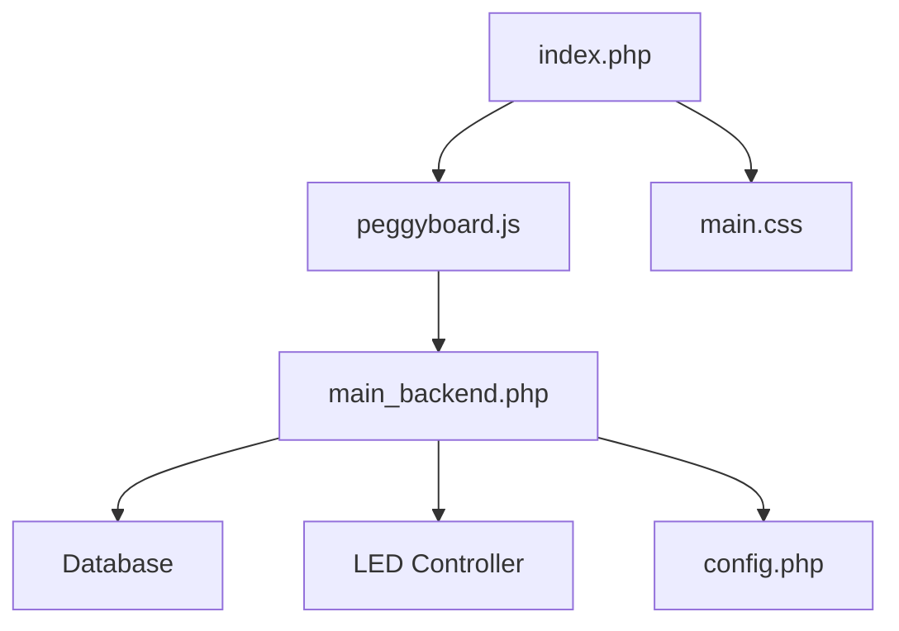

  

 

  

 

This is a fork of https://github.com/PegorK/PeggyBoard. I ran the original project as-is and had to modify it for my setup for a grid board layout, subsequently found it tricky to get the initial setup on the Raspberry Pi working. After setup I wired my Raspberry Pi with screen to a ~4 meter extension cable so I could see the wall while setting. Eventually switched to just using my phone and not the touchscreen at all. This then gave me the idea of just using a cheap ESP32 device for LED controller and my already running home NAS for the Web Application runtime. This has been running great for the last few months, it's now provided publicly if anyone else has similar needs.  

There are some key differences between this fork and original:
- Uses an ESP32 development board with Tasmota as an LED controller. 
- The WepApp connects to the ESP32 and controls the lights using web requests
- The WebApp is intended to be run off a server in your local network (eg: Synology NAS/Raspberry Pi)
- The WebApp is primarily accessed remotely using a phone

## Features

    <table>
        <tr>
            <td>
                

                    
                     <b>Figure 1.</b> Route creation page.
                

            </td>
            <td>
                

                    
                     <b>Figure 2.</b> Searching for routes previously made.
                

            </td>
            <td>
                

                    
                     <b>Figure 3.</b> Saving a route.
                

            </td>
        </tr>
    </table>

When accessing the app through a mobile device the user is presented with the route creation page as seen in Figure 1. This is where the user can interact with the wall by clicking different dots to set them up as either "Starting Holds" (green), "Foot Holds" (blue), "Hand Holds" (pink), or "Finishing Holds" (red). Each time a user presses on a dot it changes the type and doesn't let you set more than two of "Starting Holds" and "Finishing Holds".

  
   <b>Figure 4.</b> Alternating through holds.

The user can also view previously saved routes by clicking the folder icon or save their current route by clicking the save icon. When the user is ready to climb one of the routes they can press the light bulb icon and it will then light up the respective holds on the wall as seen in Figure 5.

  
   <b>Figure 5.</b> PeggyBoard displaying a route.

# Updates

There are several different features available from the fork.

## Route Creation
- Route name generator allows quickly picking a route name
- Author name is defaulted from configuration, no need to specify every time

## Board Layout
- Different board layouts available, grid (moonboard style) and zigzag
- Configurable size grid layout added for grid layout
- LED's light up when individually modified, making route setting more intuitive
- Existing routes can be regraded with the dropdown next to route name

## Playlists
- A playlist feature added that allows different playlists to be created
- A playlist has a name, minimum grade, maximum grade and a sorting preference
- When opening a playlist the default buttons change, providing a previous, next and stop button
- The title of the route shows the position in the playlist (See figure 6)

  
   <b>Figure 6.</b> Using a playlist.

## Database
- No longer dependent on MySql, Sqlite3 works quite effectively
- Sqlite3 provides database and schema creation if they don't exist

## LED Controller
- Relies on a separate Tasmota based LED controller to control addressable LED's

# Setup

The setup of this fork is a bit different from the main project. 

## Overview
The basic structure of the application is similar to the main project, with core differences in the backend:

* All configuration available in config.php
* Database: no dependency on MySql, simply update the database connection string in config.php, sqlite is simple - database and schemas auto-created. 
* LED Controller: relies on Tasmota, specify the endpoint in config.php

## LED controller - Tasmota
- Flash your ESP device (Espressif ESP8266, ESP32, ESP32-S or ESP32-C3 dev boards) with the latest version of Tasmota
- Configure the device to connect to your local Wifi
- Setup the device with a GPIO pin as WS8212 type 1, I used GPIO13
- Assign a static IP or hostname to device

## WebApp - Docker
- Build the Docker file with the embedded configuration (config.php) of your setup
- Map port 80 from the container to desired port
- Volume mount /var/www/db to persist your database outside of the container

## WebApp - Server
Follow the instructions on the main project page around PHP setup. Essentially:
- Install PHP 7.2 on a Webserver
- Copy the PeggyBoard project files into the web server root directory
- Fix any permission problems

## Hardware

Addressable LED's typically run at 5v DC, DC voltage can be negatively affected by wire lengths. 
Keeping wire runs as short as possible and using shielded/thicker cables will minimise signal interference and LED flicker/dim. 
Joining the 5V and ground rails as per diagram will also help. 

### Parts
* [3.3V to 5V Level Shift (for LEDs)](https://littlebirdelectronics.com.au/products/iic-i2c-logic-level-converter-bi-directional-module-5v-to-3-3v-for-arduino) $3aud
* [5V 30A Power Supply](https://www.ebay.com.au/itm/112843990043) $25aud. After testing, 50 LED's at full brightness use around 2A. Pick your supply to suit your needs.
* [WS2811 - Addressable LEDs](https://www.aliexpress.com/item/1005001861198844.html) $170aud/250 lights - 25cm minimum length for 20cm by 20cm grid.
* [ESP32 Dev Board](https://www.amazon.com.au/esp32-wroom/s?k=esp32+wroom) $8aud

Additionally, the following may also be needed if you don't have anything spare. Automotive connectors are handy, they're water proof, cheap and easy to install.
* [Auto Connectors](https://www.amazon.com.au/Twippo-Waterproof-Electrical-Automotive-Connectors/dp/B092PL9W7K) $25aud - other JST connectors ok too.
* [Twin Core Cable](https://www.amazon.com.au/Electrical-Cable-Electric-Extension-Sheath/dp/B07HK2WDSZ) $40aud - you need around 5-10 meters depending on where you install the power supply. 
* [Header jumper cables](https://www.ebay.com.au/itm/355301522984) $4aud - female-female cables
* Project box to house it in could be useful. 

  
   <b>Figure 12.</b> LED strip connections.

  
   <b>Figure 13.</b> LED bulbs on the back of the wall.

### Credit
[Buy original dev a Coffee!](https://www.buymeacoffee.com/pegor)
