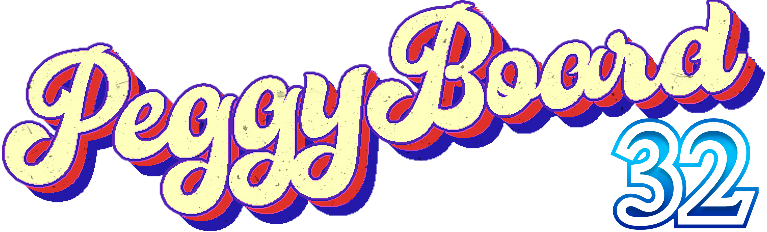

  

 

  

 

This project provides a cost effective, well featured alternative LED bouldering wall. Use any size wall, with any holds you want and set the holds however you like. The project contains a hardware list, software setup instructions and web application. 

This is a fork of https://github.com/PegorK/PeggyBoard, due to the significant changes made it's not a trivial merge back so being maintained here. 

There are some key differences between this fork and original:
- Uses an ESP32 development board with [Tasmota](https://tasmota.github.io/docs/) as an LED controller. 
- The WepApp connects to the ESP32 and controls the lights using [web requests](https://tasmota.github.io/docs/Commands/#with-web-requests)
- The WebApp is intended to be run off a server in your local network (eg: NAS/Raspberry Pi)
- The WebApp is primarily accessed remotely using a phone
- Backend database was switched to SQLite

## Features

    <table>
        <tr>
            <td>
                

                    
                     <b>Figure 1.</b> Route creation page.
                

            </td>
            <td>
                

                    
                     <b>Figure 2.</b> Searching for routes previously made.
                

            </td>
            <td>
                

                    
                     <b>Figure 3.</b> Saving a route.
                

            </td>
        </tr>
    </table>

When accessing the app through a mobile device the user is presented with the route creation page as seen in Figure 1. This is where the user can interact with the wall by clicking different dots to set them up as either "Starting Holds" (green), "Foot Holds" (blue), "Hand Holds" (pink), or "Finishing Holds" (red). Each time a user presses on a dot it changes the type and doesn't let you set more than two of "Starting Holds" and "Finishing Holds".

  
   <b>Figure 4.</b> Alternating through holds.

The user can also view previously saved routes by clicking the folder icon or save their current route by clicking the save icon. When the user is ready to climb one of the routes they can press the light bulb icon and it will then light up the respective holds on the wall as seen in Figure 5.

  
   <b>Figure 5.</b> PeggyBoard displaying a route.

# Updates

There are several different features available from the fork.

## Route Creation
- Route name generator allows quickly picking a route name
- You can specify your own lists of base names for generation by changing the reference files
- Author name is defaulted from configuration, no need to specify every time

## Board Layout
- Different board layouts available, grid (moonboard style) and zigzag (original Peggyboard implementation)
- Configurable size grid layout added for grid layout
- LED's light up when individually modified, making route setting more intuitive
- Existing routes can be regraded with the dropdown next to route name

## Playlists
- A playlist feature added that allows different playlists to be created
- A playlist has a name, minimum grade, maximum grade and a sorting preference
- When opening a playlist the default buttons change, providing a previous, next and stop button
- The title of the route shows the position in the playlist (See figure 6)

  
   <b>Figure 6.</b> Using a playlist.

## Sessions
- Start a session and track all of the ticks and attempts you have during your climbing session.
- Records session start time, finish time, duration and all the climbs attempted.
- Able to switch between playlists and specific routes to track everything.
- Session summary available to view during session and provided at the end of the session. 

    <table>
        <tr>
            <td>
                

                    
                     <b>Figure 7.</b> Session menus
                

            </td>
            <td>
                

                    
                     <b>Figure 8.</b> Ending a session dialog
                

            </td>
            <td>
                

                    
                     <b>Figure 9.</b> Session summary
                

            </td>
        </tr>
    </table>

## Database
- No longer dependent on MySql, Sqlite works quite effectively
- Sqlite provides database and schema creation if they don't exist

## LED Controller
- Relies on a separate Tasmota based LED controller to control addressable LED's

# Setup

A summary of the setup is provided, refer to the proceeding sections for more detailed steps.

1. Setup your ESP32 device with Tasmota software and configure as addressable LED's.
2. Deploy the WebApp to a device on your local network (Docker based or server based).
3. Test your WebApp on your desk before installation. 
4. Install hardware into your woody.

## LED controller - Tasmota
- Flash your ESP device (eg: ESP8266, ESP32, ESP32-S, ESP32-C3, etc.. dev boards) with the latest version of Tasmota. [Web Installer](https://tasmota.github.io/install/)
- Configure the device to connect to your local Wifi
- Setup the device with a GPIO pin as WS8212 type 1, I used GPIO13
- Assign a static IP or hostname to device

  
   <b>Figure 10.</b> Tasmota Configuration.

## WebApp
Find somewhere on your local network to run the Javascript & PHP application. 

### Configuration
Modify config.php with values specific to your woody. These are the key configuration changes:
- <b>tasmota.commandPath</b>: Specify the path of your Tasmota device to run web commands.
- <b>frontend.wallLayout</b>: Specify either 'grid' or 'gridOffset'. Note that gridOffset assumes a fixed size wall of 35x21.
- <b>frontend.holdHeight</b>: Number of holds in height the wall is.
- <b>frontend.holdWidth</b>: Number of holds in width the wall is.
- <b>frontend.defaultAuthor</b>: Whose name is displayed by default for new routes. 

### Option 1 - Docker Runtime
- Build the Docker file with the embedded configuration (config.php) of your setup
- Map port 80 from the container to desired port
- Volume mount /var/www/db to persist your database outside of the container

### Option 2 - Server Runtime
- Install PHP 7.2 on a Webserver
- Copy the PeggyBoard project files into the web server root directory
- Fix any permission problems
- Add the configuration (config.php) to your setup. 

## Testing 

Test your WebApp can connect to your ESP device and the WebApp can control the LED's before installation. 
If you forget to do this it might be annoying to troubleshoot. 

A quick test would be to navigate to your WebApp in a browser and select the bottom-left LED as blue, 
the first LED in the string should illuminate, change it to red, pink and green. Validate no other LED's 
turn on and colours reflect accurately. 

Repeat the same steps with the first few lights in the string. 

## Hardware

1. Order required parts. 
2. Drill 12-12.3mm (31/64") holes for the leds on your board.
3. Optional, but recommended to replace led connectors, split the data line from the power+ground lines as per Figure 12.
4. Install leds onto board. 
   - 4.1 Start bottom left (A1)
   - 4.2 Move to top left (A19) 
   - 4.3 Move one right (B19) 
   - 4.4 Move down to the bottom (B1)
   - 4.5 Move one right (C1)
   - 4.6 Keep repeating pattern until complete
5. Connect LED data lines together in series as per Figure 12.
6. Connect power supply directly to each LED string as per Figure 12.
7. Connect ESP device and level shift to power supply.
8. Connect ESP device to level shift.
9. Connect level shift to led data line at bottom left of board (A1).

> [!NOTE]
> Addressable LED's typically run at 5v DC, DC voltage can be negatively affected by wire lengths. 
> Keeping wire runs as short as possible and using shielded/thicker cables will minimise signal interference and LED flicker/dim. 
> Joining the 5V and ground rails as per diagram will also help. Poor grounding, interferce and insufficient power supply can result in leds not displaying correct colours, incorrectly lighting up or failing to work altogether. 

### Parts
* [3.3V to 5V Level Shift (for LEDs)](https://littlebirdelectronics.com.au/products/iic-i2c-logic-level-converter-bi-directional-module-5v-to-3-3v-for-arduino) $3aud
* [5V 30A Power Supply](https://www.ebay.com.au/itm/112843990043) $25aud. After testing, 50 LED's at full brightness use around 2A. Pick your supply to suit your needs, 2A phone charger might be fine if you're only lighting a dozen or two holds at a time. If you do want to light up every led, size the power supply suitably (number of LED's * 40 = minimum power supply size in mA - so size bigger)
* [WS2811 - Addressable LEDs](https://www.aliexpress.com/item/1005001861198844.html) $170aud/250 lights - 25cm minimum length for 20cm by 20cm grid.
* [ESP32 Dev Board](https://www.amazon.com.au/DIGISHUO-ESP8266-NodeMCU-Development-Micropython/dp/B0966LHM29) $8aud

Additionally, the following may also be needed if you don't have anything spare. Automotive connectors are handy, they're water proof, cheap and easy to install.
* [Auto Connectors](https://www.amazon.com.au/Twippo-Waterproof-Electrical-Automotive-Connectors/dp/B092PL9W7K) $25aud - other JST connectors fine too.
* [Twin Core Cable](https://www.amazon.com.au/Electrical-Cable-Electric-Extension-Sheath/dp/B07HK2WDSZ) $40aud - you need around 5-10 meters depending on where you install the power supply and how big your wall is.
* [Header jumper cables](https://www.ebay.com.au/itm/355301522984) $4aud - female-female cables
* Project box to house it in could be useful. 

  
   <b>Figure 12.</b> LED strip connections.

  
   <b>Figure 13.</b> LED bulbs on the back of the wall.

## Application Architecture
The basic structure of the application is similar to the main project, with core differences in the backend:

* All configuration available in config.php
* Database: no dependency on MySql, simply update the database connection string in config.php, sqlite is simple - database and schemas auto-created. 
* LED Controller: relies on Tasmota, specify the endpoint in config.php

### Credit
[Buy original dev a Coffee!](https://www.buymeacoffee.com/pegor)
